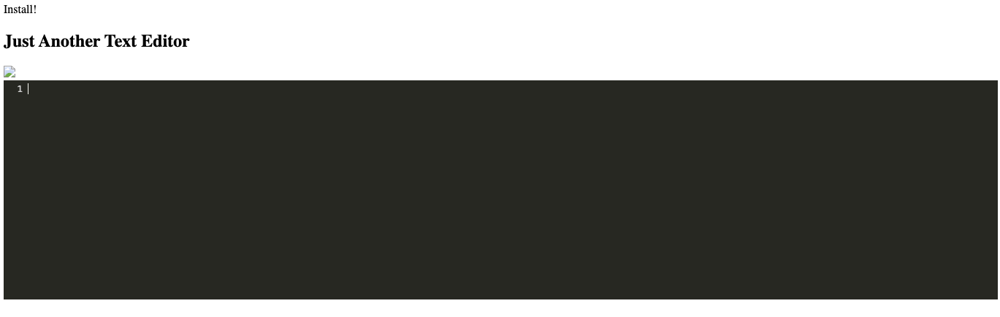

# Text-Editor

This application is a browser-based text editor designed as a single-page application that meets PWA standards. It incorporates multiple data persistence methods, ensuring redundancy if a particular option is unsupported by the browser. Additionally, the application is capable of functioning offline.

  
 
  ## Installation
  Clone repo and run `npm install && npm run install`.

  ## Usage
  To run the application, execute the command `npm run build && npm run server`.

  ## Screenshot
  

  ## Features
  Capability to create notes or code snippets with or without an internet connection.

  ## License
    Licensed under the MIT license.